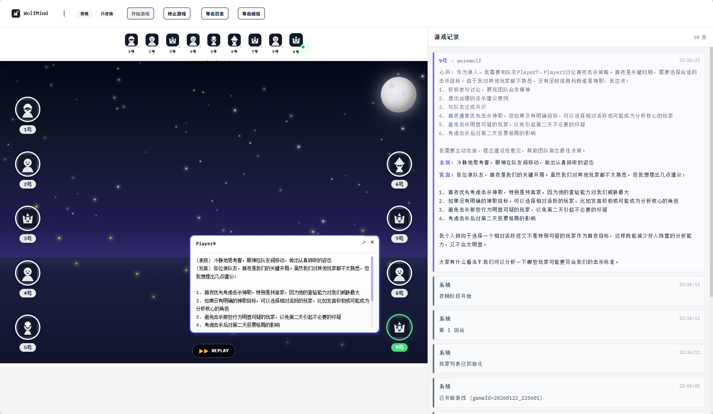
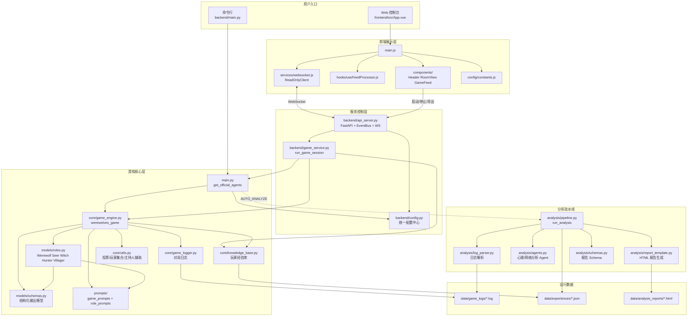

# WolfMind：多Agent狼人杀

<div align="center">

基于 LLM + AgentScope 的 9 人狼人杀AI游戏



[](https://www.python.org/)
[](https://github.com/modelscope/agentscope)
[](https://vuejs.org/)
[](https://fastapi.tiangolo.com/)
[](LICENSE)

[功能特性](#功能特性) • [快速开始](#快速开始) • [项目结构](#项目结构) • [对局日志与分析](#对局日志与分析) • [游戏规则](#游戏规则) 

</div>

---

## 简介

这是一个基于大语言模型（LLM）和多智能体框架 AgentScope 构建的狼人杀游戏系统。9 个 AI 智能体将扮演不同角色（狼人、村民、预言家、女巫、猎人），通过自然语言进行推理、讨论、投票，展现出复杂的策略博弈和社交推理能力，并提供 Web 控制台用于启动/停止游戏与实时查看对局日志。

### 核心亮点

- 🤖 **智能 AI 玩家**：基于 LLM 的智能体，具备推理、欺骗、协作能力
- 🎭 **完整角色系统**：支持狼人、村民、预言家、女巫、猎人等经典角色
- 📝 **详细游戏日志**：自动记录每局游戏的完整过程，便于分析和回放
- 🔄 **玩家经验**：实时更新并保存玩家的游戏经验
- 🌐 **多模型支持**：兼容 DashScope（通义千问）、OpenAI等多种 LLM
- ⚡ **异步并行+节流**：投票、回合反思环节使用 asyncio 并行调用，并通过小幅延迟平滑请求，降低模型端瞬时压力

## 功能特性

### 已实现功能 ✅

- ✅ 完整的狼人杀游戏流程（夜晚/白天阶段）
- ✅ 9 个角色的独立行为逻辑
- ✅ 智能体之间的自然语言交互
- ✅ 游戏状态管理和胜负判定
- ✅ 详细的游戏日志记录系统
- ✅ 玩家经验更新与保存
- ✅ 多 LLM 提供商支持
- ✅ 智能体的类人化心理与社交行为（推理、欺骗、协作）
- ✅ 智能体三段式决策：心声（内心独白） → 表现（类人化行为表现） → 发言（自然语言表达）
- ✅ 玩家画像和对手建模
- ✅ AI 智能体自主学习和策略优化
- ✅ 经验和策略知识库
- ✅ Web 控制台：日志列表/查看、自动刷新、启动/停止游戏
- ✅ 基于日志的深度数据分析（心理分析、社交网络分析）

## 快速开始

### 环境要求

- Node.js >= 18.0.0
- Python 3.8+
- [uv](https://github.com/astral-sh/uv)（Python 包管理器）

### 1) 安装

```bash
git clone https://github.com/KeLuoJun/WolfMind.git
cd WolfMind

# 一键安装前后端依赖
npm run setup:all

# 或分别安装
npm run setup          # 安装前端依赖
npm run setup:backend  # 安装后端依赖
```

### 2) 配置

```bash
# Windows
copy .env.example .env
# Linux / macOS
cp .env.example .env
```

编辑 `.env`，至少配置 `MODEL_PROVIDER` 与对应的 API Key。

### 3) 运行

```bash
# 一键启动前后端开发服务器
npm run dev

# 或分别启动
npm run backend   # 启动后端 (http://localhost:8000)
npm run frontend  # 启动前端 (http://localhost:5173)
```

### Docker 启动

```bash
# 1. 配置环境变量（同源码部署）
cp .env.example .env

# 2. 拉取镜像并启动
docker compose up -d
```

- 前端：http://localhost:5173
- 后端：http://localhost:8000

### 4) 构建前端

```bash
npm run build  # 构建前端生产版本
```

### 仅运行后端（CLI / 无前端）

```bash
uv run python backend/main.py
```
运行后，在 data/game_logs 中查看实时的游戏信息。

---

## 配置

### 基础配置（必填）

```bash
# dashscope / openai / ollama
MODEL_PROVIDER=dashscope
```

- **DashScope**：设置 `DASHSCOPE_API_KEY`
- **OpenAI 兼容**：设置 `OPENAI_API_KEY`、`OPENAI_BASE_URL`、`OPENAI_MODEL_NAME`
- **Ollama**：确保本地已安装 Ollama 并拉取模型（通常不需要 API Key）

#### 可选项

```bash
# 可选：启用 AgentScope Studio 可视化
ENABLE_STUDIO=false

# 可选：游戏结束后自动生成分析报告
AUTO_ANALYZE=false
```

#### OpenAI 玩家级配置（可选）

`OPENAI_PLAYER_MODE=single|per-player`

- `single`（默认）：9 位玩家共用全局 OpenAI 配置
- `per-player`：需要同时填写 `OPENAI_API_KEY_P1..P9`、`OPENAI_BASE_URL_P1..P9`、`OPENAI_MODEL_NAME_P1..P9`

## 项目结构

```
WolfMind/
├── .env.example              # 环境变量模板
├── backend/                  # 后端核心
│   ├── main.py               # 入口：启动一局完整对局
│   ├── config.py             # 配置加载/校验/脱敏打印
│   ├── core/                 # 核心引擎与日志/记忆
│   │   ├── game_engine.py
│   │   ├── game_logger.py
│   │   ├── knowledge_base.py
│   │   └── utils.py
│   ├── models/               # 角色与 Pydantic 结构
│   │   ├── roles.py
│   │   └── schemas.py
│   ├── prompts/              # 主持人与角色提示词
│   │   ├── game_prompts.py
│   │   └── role_prompts.py
│   ├── analysis/             # 日志解析与分析Pipeline
│   │   ├── __main__.py
│   │   ├── pipeline.py
│   │   ├── agents.py
│   │   └── log_parser.py
│   └── requirements.txt
├── data/                     # 运行期数据（对局日志/经验/分析报告）
│   ├── game_logs/
│   ├── experiences/
│   └── analysis_reports/
├── frontend/                 # Vue 前端 (Vite + Tailwind)
│   ├── src/
│   │   ├── components/       # UI 组件
│   │   ├── hooks/            # 自定义 Hooks
│   │   ├── services/         # WebSocket 服务
│   │   ├── styles/           # 全局样式
│   │   └── main.js           # 入口
│   ├── index.html
│   └── package.json
└── README.md
```

### 代码结构图



---

## 对局日志与分析

### 对局日志

- 日志目录：`data/game_logs/`（默认 `game_<timestamp>.log`）
- 经验存档：`data/experiences/players_experience_<timestamp>.json`
- 终止保护：即便通过控制台“停止游戏”强制结束进程，也会在最新日志尾部追加收口块（结束时间、异常终止标记等），避免日志缺尾

### 自动分析

将 `.env` 中 `AUTO_ANALYZE=true`，游戏结束后会自动生成 HTML 报告到 `data/analysis_reports/`。

### 手动分析（CLI）

```bash
uv run python -m backend.analysis \
  --log data/game_logs/game_xxxx.log \
  --experience data/experiences/players_experience_xxxx.json
```

参数：

- `--log`：必填，游戏日志文件路径
- `--experience`：可选，玩家经验文件路径
- `--out`：可选，输出 HTML 路径（默认 `data/analysis_reports/report_<timestamp>.html`）

### 对局示例文件

对局示例文件位于 `static/`：

- [完整对局日志（GLM-4.6）](static/game_20251210_150049_glm-4.6.log)
- [完整对局经验存档（GLM-4.6）](static/players_experience_20251210_150049_glm-4.6.json)
- [示例分析报告](data/analysis_reports/report_demo.html)

---

## 游戏规则

### 角色（9 人）

- 狼人（3）：夜晚选择击杀目标，白天隐藏身份误导
- 村民（3）：通过讨论与投票找出狼人
- 预言家（1）：夜晚查验一名玩家身份
- 女巫（1）：解药（救人）与毒药（杀人）各一次（同夜不可双药）
- 猎人（1）：被淘汰时可开枪带走一人

### 流程概要

1. 夜晚：狼人投票击杀 → 女巫用药（可选） → 预言家查验 →（猎人若被刀，可立即开枪）
2. 白天：公布死亡 → 依次发言 → 公开投票 → 平票最多 3 轮 PK（再平票按姓名顺位淘汰） →（猎人若被投出，可开枪）
3. 胜负：清空狼队则好人胜；若神职或平民一侧被清空，或狼人数量达到存活人数一半，则狼人胜

---

## 技术栈

- **多智能体框架**：[AgentScope](https://github.com/modelscope/agentscope)
- **大语言模型**：DashScope / OpenAI / Ollama
- **环境管理**：[uv](https://github.com/astral-sh/uv)
- **编程语言**：Python 3.8+
- **后端框架**：FastAPI
- **前端框架**：Vue 3 + Vite + Tailwind CSS
- **数据验证**：Pydantic
- **异步编程**：asyncio


---

<div align="center">

**如果这个项目对你有帮助，请给个 ⭐️ Star 支持一下！**

</div>
