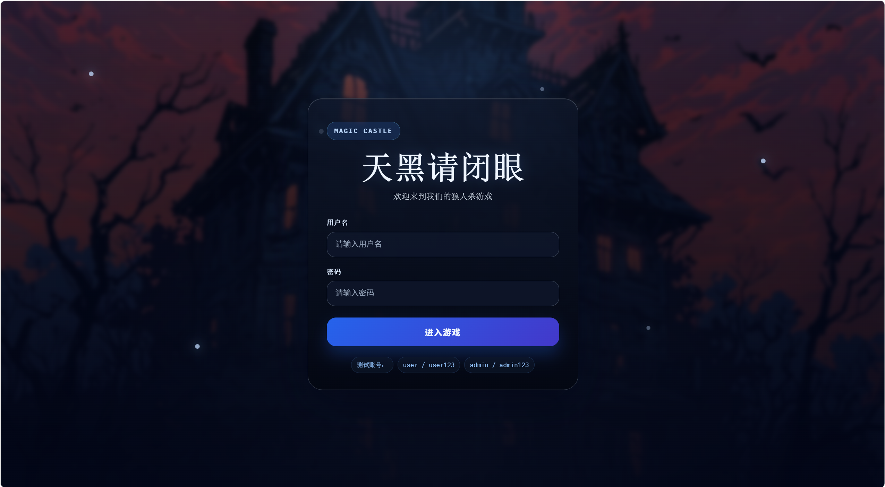
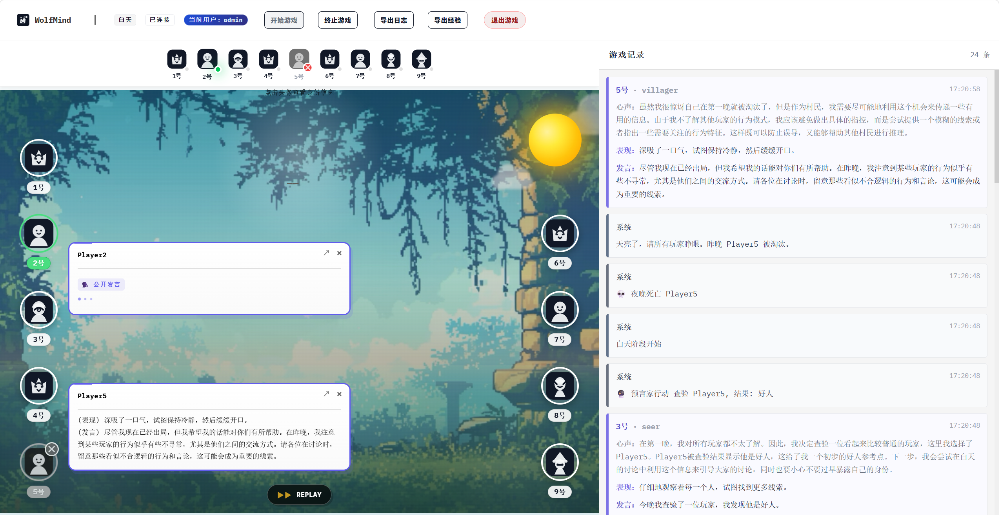
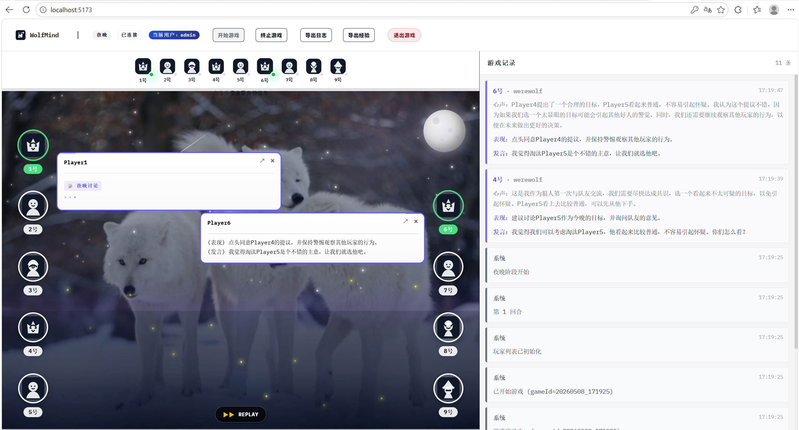
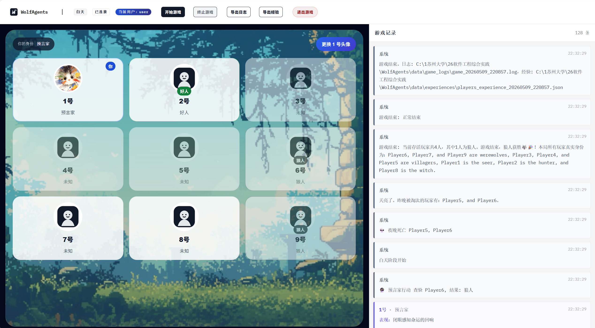
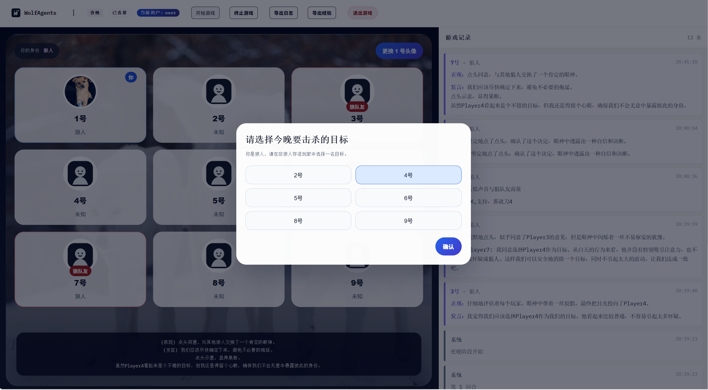
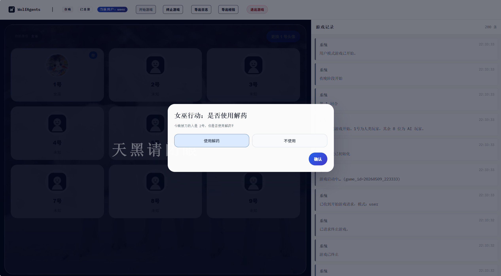

# WolfAgents：多 Agent 狼人杀游戏平台

<div align="center">

基于 LLM + AgentScope + FastAPI + Vue 3 的狼人杀多智能体对战与人机共玩系统



[](https://www.python.org/)
[](https://github.com/modelscope/agentscope)
[](https://vuejs.org/)
[](https://fastapi.tiangolo.com/)
[](./LICENSE)

[项目亮点](#项目亮点) • [界面预览](#界面预览) • [快速开始](#快速开始) • [模式说明](#模式说明) • [日志与分析](#日志与分析) • [项目结构](#项目结构)

</div>

---

## 项目简介

`WolfAgents` 是一个围绕狼人杀场景构建的多智能体博弈平台。项目不仅支持经典的 `9 AI Agent` 自动对局，也支持 `8 AI + 1 人类玩家` 的交互式 user 模式。系统将狼人杀中的讨论、投票、夜间技能、阵营对抗、回合记忆与跨局经验学习进行了完整实现，并通过 Web 控制台实时展示。

当前项目已经覆盖：

- 完整的 9 人狼人杀规则流程
- `admin` 与 `user` 两套独立前端体验
- AI 智能体三段式输出：`心声 thought` -> `表现 behavior` -> `发言 speech`
- 对 user 模式的公平性约束与私有信息隔离
- 对局日志、经验存档、分析报告的一体化闭环
- 多模型接入与玩家级模型配置

## 项目亮点

### 1. 双模式游戏体验

- `admin` 模式：保留 9 个 Agent 同台博弈的演示视角，适合展示、观察和导出日志。
- `user` 模式：固定 1 号为人类玩家，和 8 个 AI 一起完成整局狼人杀。
- 两个模式使用独立界面逻辑，避免 user 模式改动影响 admin 模式。

### 2. 真正可参与的人类玩家链路

user 模式不是“旁观式接入”，而是完整参与狼人杀流程：

- 白天轮到 1 号时，可弹窗输入发言
- 放逐投票阶段，可手动选择投票对象或弃权
- 遗言阶段，可输入自己的遗言
- 若为狼人，可参与夜聊与夜间击杀投票
- 若为女巫，可分别决策是否使用解药与毒药
- 若为预言家，可查验未查验玩家并持续保留结果标记
- 若为猎人，被淘汰时可选择是否开枪带走目标

### 3. 公平性优先的 user 模式设计

这是当前版本最重要的创新点之一。

- AI 的 `thought/心声` 不会在 user 模式的任何公开区域显示
- 夜间私有事件按 `scope` 做隔离，只推送给应当看到的人
- 非狼人玩家夜晚会看到统一的“天黑请闭眼”遮罩，无法旁观狼人行动
- 狼人玩家仅能看到狼队友标记，不会直接看到其他人的精确身份
- 预言家只会看到自己查验过的“好人/狼人”结果，不会额外泄露身份
- 夜间提示统一显示在画面底部，不再贴在角色卡旁边，降低位置泄密风险

### 4. 多层次智能体行为建模

项目不只是让模型“说话”，而是把一次行动拆成三个层次：

- `心声`：私有思考与策略推演
- `表现`：外在动作、神态和非语言线索
- `发言`：面向其他玩家的公开表达

这种设计让 AI 既有可解释性，也能更像真实玩家进行社交博弈。

### 5. 跨局经验学习与对局分析

- 每局结束后保存玩家经验文件
- 回合结束时更新对其他玩家的印象
- 支持基于日志与经验文件生成 HTML 分析报告
- 可分析玩家心理、社交网络和局势演化过程
- 前端可查看玩家 hover insights，展示印象与经验摘要

### 6. 多模型接入与玩家级配置

系统已支持：

- DashScope
- OpenAI 兼容接口
- Ollama 本地模型

其中 OpenAI 兼容模式支持：

- 全员共用同一模型
- 按玩家分别配置 `P1 ~ P9` 的模型、Key 和 Base URL

这使项目不仅适合课程展示，也适合实验不同模型在社交推理场景下的表现差异。

## 界面预览

### 登录界面


### admin 模式场景




### user 模式场景

#### user 模式白天



#### user 模式夜晚：狼人视角



#### user 模式夜晚：女巫视角



## 功能总览

### 已完成能力

- 完整狼人杀流程：夜晚行动、白天讨论、投票、遗言、胜负判定
- 角色系统：狼人、村民、预言家、女巫、猎人
- AI 类人化表达：行为、发言、私有心声三层输出
- `admin/user` 双前端入口与登录分流
- user 模式人类交互弹窗与夜间角色操作
- 用户头像本地上传替换（1 号位）
- WebSocket 实时事件流推送
- 详细游戏日志导出
- 玩家经验 JSON 导出
- 自动/手动分析报告生成
- 停止游戏时的日志收口保护
- 前端对局记录、公屏、角色气泡与回放辅助
- 多模型支持与每位玩家独立模型配置

### 默认登录账号

- 用户：`user / user123`
- 管理员：`admin / admin123`

## 模式说明

### admin 模式

- 面向演示与观察
- 9 个 AI Agent 全自动完成整局游戏
- 可直接查看各玩家行为、发言、日志与分析产物
- 保留原有大地图房间视图、消息流和头像信息面板

### user 模式

- 固定 `Player1` 为人类玩家
- 前端位于 `frontend/src/user/`
- 开局会全屏展示人类玩家身份牌，持续约 3 秒
- 白天、投票、遗言、夜间技能均通过弹窗完成交互
- 可点击 1 号头像上传本机图片，自定义头像

#### user 模式中的身份体验

- 若你是狼人：
  - 能看到狼队友标记
  - 夜晚可参与狼人讨论
  - 可参与选择今晚击杀目标
- 若你是女巫：
  - 会收到今晚刀口提示
  - 可独立决定是否救人、是否下毒
- 若你是预言家：
  - 每晚可查验一名未查验存活玩家
  - 查验结果会持续标注在对应头像上
- 若你是猎人：
  - 被淘汰时可决定是否开枪带走一名玩家
- 若你是普通好人：
  - 夜晚不会看到不该知道的信息
  - 画面仅显示“天黑请闭眼”

## 技术架构

### 后端

- `FastAPI`：提供启动/终止游戏、导出日志、导出经验、查询人类待处理动作等接口
- `WebSocket`：推送实时结构化游戏事件
- `AgentScope`：承载多智能体协作与推理
- `GameLogger`：统一写入日志并广播结构化事件
- `HumanInputBroker`：在人类玩家需要操作时创建待处理请求并等待提交结果
- `analysis pipeline`：对日志和经验做二次分析，生成 HTML 报告

### 前端

- `Vue 3 + Vite`
- `admin` 视图与 `user` 视图分离
- `GameFeed` 负责公屏消息流显示
- `RoomView` 负责 9 Agent 场景展示与信息面板
- `UserGameView` 负责人类参与版狼人杀交互
- `ReadOnlyClient` 负责 WebSocket 连接、断线重连与心跳

### 数据闭环

1. 对局运行时写入结构化日志
2. 回合结束时更新印象与经验知识
3. 游戏结束后导出 `.log` 与 `.json`
4. 可选自动生成分析 HTML 报告

## 快速开始

### 环境要求

- `Node.js >= 18`
- `Python >= 3.13`
- [`uv`](https://github.com/astral-sh/uv)

### 1. 克隆项目

```bash
git clone https://github.com/Waterwaterdog/WolfAgents.git
cd WolfAgents
```

### 2. 安装依赖

```bash
# 一键安装前后端依赖
npm run setup:all

# 或分开安装
npm run setup
npm run setup:backend
```

### 3. 配置环境变量

```bash
# Windows
copy .env.example .env

# macOS / Linux
cp .env.example .env
```

至少需要配置：

- `MODEL_PROVIDER`
- 对应平台的 API Key 或模型配置

### 4. 启动项目

```bash
# 一键启动前后端开发服务器
npm run dev
```

默认地址：

- 前端：`http://localhost:5173`
- 后端：`http://localhost:8000`
- 后端文档：`http://localhost:8000/docs`

### 5. 单独启动

```bash
npm run backend
npm run frontend
```

### 6. 构建前端

```bash
npm run build
```

### 7. 仅运行后端 CLI

```bash
uv run python backend/main.py
```

## 配置说明

### 模型提供商

```bash
MODEL_PROVIDER=dashscope
```

支持：

- `dashscope`
- `openai`
- `ollama`

### OpenAI 玩家级配置

```bash
OPENAI_PLAYER_MODE=single
```

可选值：

- `single`：全员共用一个配置
- `per-player`：按 `P1 ~ P9` 单独配置模型

### 其它常用配置

```bash
MAX_GAME_ROUND=30
MAX_DISCUSSION_ROUND=3
ENABLE_STUDIO=false
AUTO_ANALYZE=false
EXPERIENCE_DIR=./data/experiences
EXPERIENCE_ID=players_experience
```

## 日志与分析

### 对局产物

每局游戏结束后会生成：

- 对局日志：`data/game_logs/game_<timestamp>.log`
- 玩家经验：`data/experiences/players_experience_<timestamp>.json`
- 分析报告：`data/analysis_reports/report_<timestamp>.html`（当启用分析时）

### 自动分析

将 `.env` 中设置为：

```bash
AUTO_ANALYZE=true
```

游戏结束后会自动生成 HTML 报告。

### 手动分析

```bash
uv run python -m backend.analysis \
  --log data/game_logs/game_xxxx.log \
  --experience data/experiences/players_experience_xxxx.json
```

可选参数：

- `--log`：日志文件路径
- `--experience`：经验文件路径
- `--out`：输出 HTML 路径

### 示例文件

仓库中已附带若干样例：

- `static/game_20251210_150049_glm-4.6.log`
- `static/players_experience_20251210_150049_glm-4.6.json`
- `data/analysis_reports/report_demo.html`

## 项目结构

```text
WolfAgents/
├── backend/
│   ├── analysis/               # 日志解析、心理分析、社交网络分析、报告生成
│   ├── core/
│   │   ├── game_engine.py      # admin 模式核心游戏流程
│   │   ├── human_game.py       # user 模式核心游戏流程
│   │   ├── game_logger.py      # 日志记录与结构化事件推送
│   │   ├── knowledge_base.py   # 玩家经验与知识库
│   │   └── utils.py            # 投票、玩家集合、规则辅助
│   ├── models/                 # 角色对象与结构化 Schema
│   ├── prompts/                # 主持人提示词与角色提示词
│   ├── api_server.py           # FastAPI + WebSocket 服务
│   ├── game_service.py         # 模式分发与对局运行入口
│   └── main.py                 # CLI 入口
├── frontend/
│   ├── public/                 # 头像、主题资源、Logo
│   ├── src/
│   │   ├── components/         # admin 模式核心组件
│   │   ├── hooks/              # feed 处理逻辑
│   │   ├── services/           # WebSocket 客户端
│   │   ├── user/               # user 模式独立页面与 API
│   │   └── App.vue             # 登录页与模式分流入口
├── data/                       # 对局日志、经验文件、分析报告
├── photos/                     # README 截图资源
├── static/                     # 示例日志和示例图片
├── task.md                     # 本轮功能任务说明
└── README.md
```

## 项目特色总结

如果你想快速理解这个项目和普通“LLM 讲故事 demo”的差异，可以看这几点：

- 它不是静态脚本，而是完整可运行的狼人杀对局系统
- 它不仅支持 AI vs AI，也支持人类真实加入游戏
- 它不仅能展示结果，还能导出日志、经验和分析报告
- 它不仅有前端可视化，还处理了 user 模式下的信息公平性问题
- 它不仅接一个模型，而是支持多模型与玩家级配置

## 许可证

本项目基于 [MIT License](./LICENSE) 开源。

---

<div align="center">

如果这个项目对你有帮助，欢迎点一个 Star。

</div>
